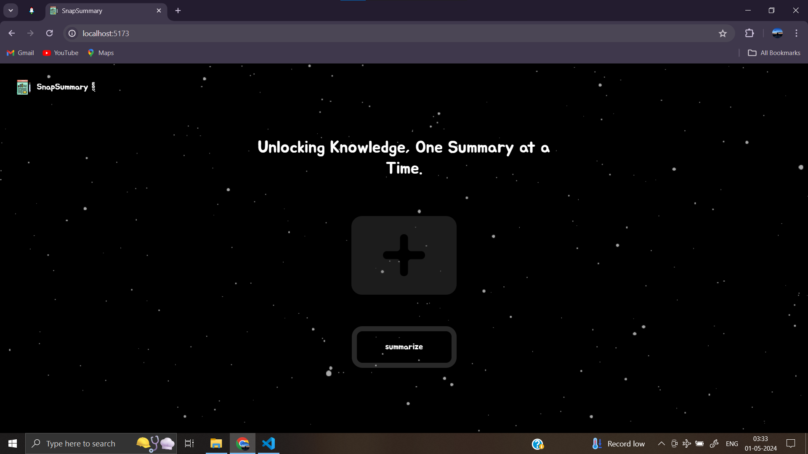
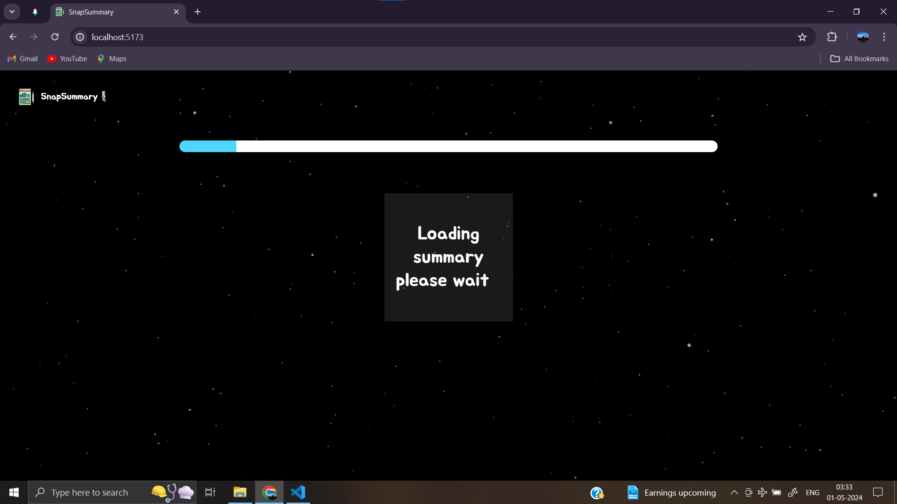
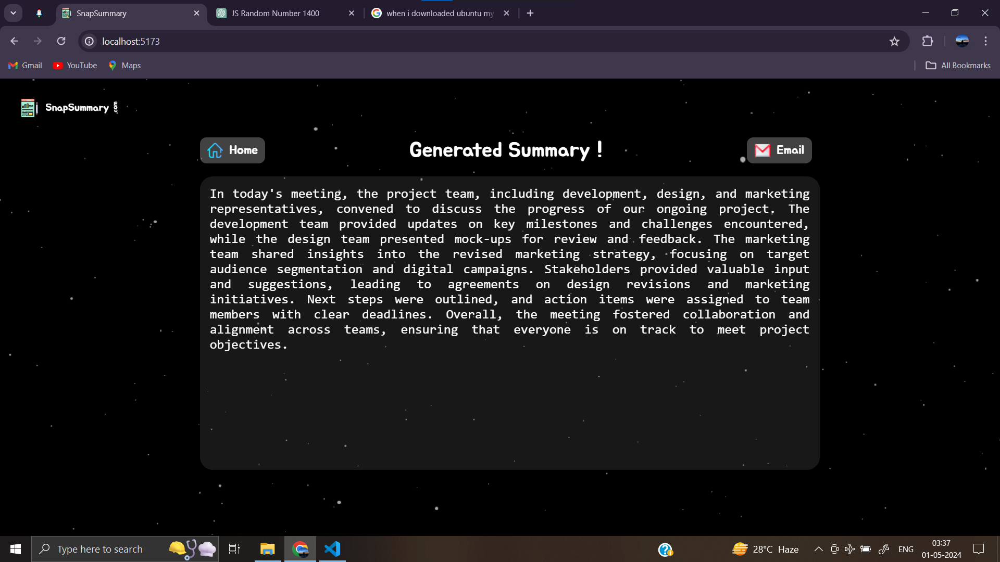
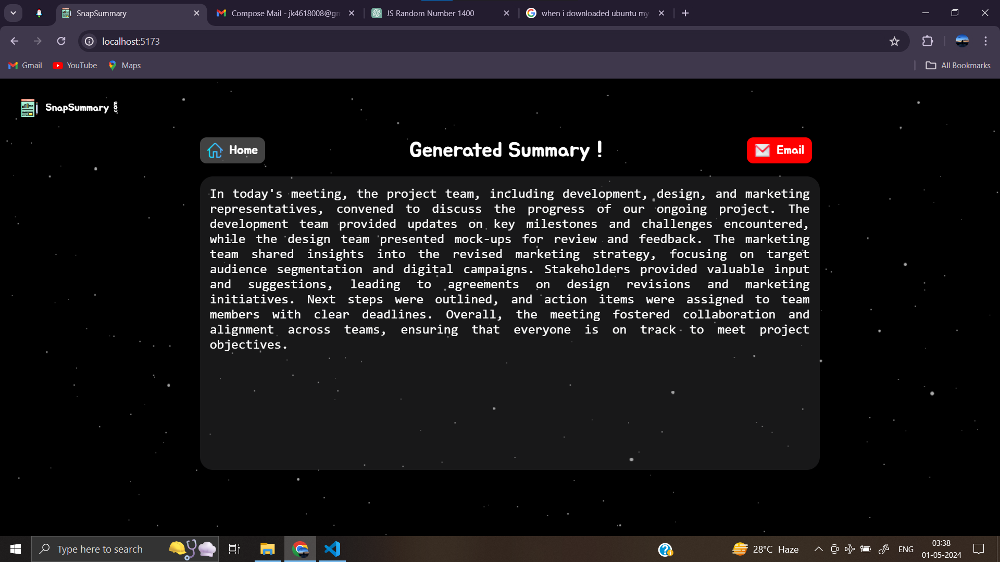

# Snap Summary

Snap Summary is a web application designed to provide concise summaries of meetings using AI technology. It utilizes React, JavaScript, Three.js, HTML, and CSS for the frontend, while integrating OpenAI API for backend functionalities.


## Features

- **Meeting Summarization**: Automatically generates short summaries of meetings based on video inputs.
- **User-Friendly Interface**: Intuitive UI for easy navigation and interaction.
- **Customizable Summaries**: Users can adjust the level of detail and length of the summary according to their preferences.
- **Interactive 3D Visualization**: Utilizes Three.js for creating immersive visualizations of background dynamics.

## Installation

1. Clone the repository:

   ```bash
   git clone https://github.com/PerfectCoder123/Snap-summary

2. Navigate to the project directory:

   ```bash
   cd Snap-Summary

3. Install dependencies:

   ```bash
   npm install

# Usage

1. Run the development server:

   ```bash
   npm run dev
2. Open your web browser and navigate to http://localhost:5173 to access Snap Summary.
3. Upload the video of the meeting you want to summarize.
4. Adjust the summary settings as desired.
5. Click on the "Generate Summary" button to generate the meeting summary.


# Screenshots









## Contributing
Contributions are welcome! Please follow the guidelines outlined in CONTRIBUTING.md.

## License

This project is licensed under the MIT License - see the [LICENSE](LICENSE) file for details.


## Acknowledgements

- [OpenAI](https://openai.com) for providing the powerful AI technology.
- [Three.js](https://threejs.org) for the interactive 3D visualization.
